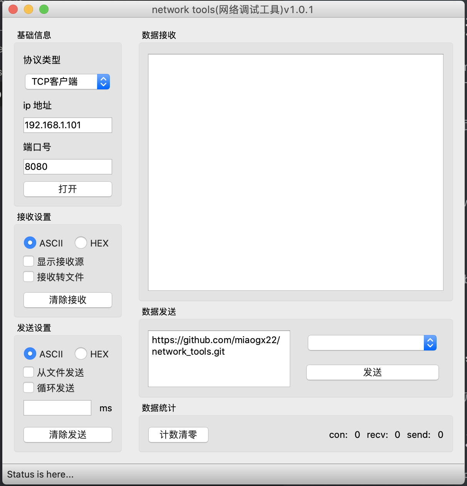

# network_tools 网络调试工具

## 1. 概述

由于在mac 上面没有发现像<网络调试助手>这样的tcp/udp开发调试工具，因此，决定用Qt写一个mac 上面的网络调试工具。支持TCP客户端，TCP服务端，UDP客户端，UDP服务端(逻辑)，UDP广播，UDP组播。

MAC界面



Windows界面


Linux/ubunu界面


## 2. 部署

直接拷贝network_tools.app到运行目录里面即可。

## 3. 开发

采用Qt开发，Qt版本：5.13.2.

### 3.1 在mac上发布

使用Release进行编译，之后进入Qt的安装目录，使用macdeployqt执行发布

```
cd /Users/miaogx/my_app/Qt/5.13.2/clang_64/bin
./macdeployqt /Users/miaogx/project/network_tools/build-network_tools-Desktop_Qt_5_13_2_clang_64bit-Release/network_tools.app
//然后network_tools.app即为要发布的程序
```


### 3.2 在windows上发布

使用Release进行编译，之后进入Qt的安装目录，使用macdeployqt执行发布

```

```


### 3.3 在Linux上发布

使用Release进行编译，之后进入Qt的安装目录，使用macdeployqt执行发布

```

```


github地址

```
https://github.com/miaogx22/network_tools.git
```

